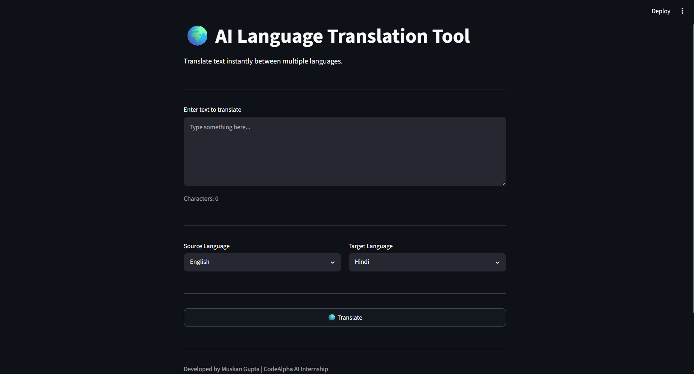
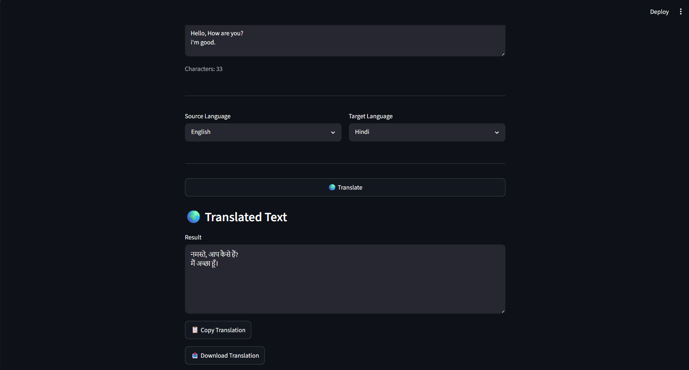
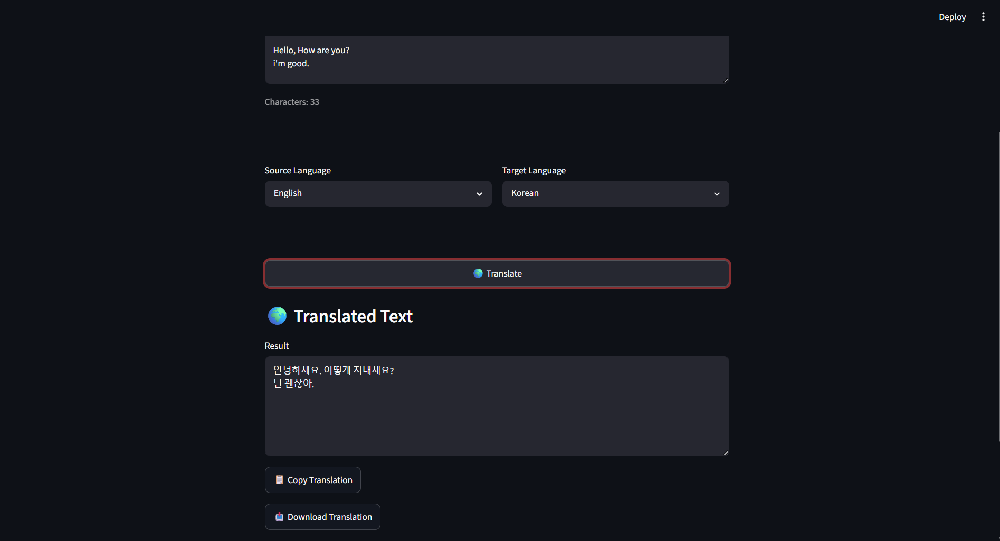

# 🌍 AI Language Translation Tool

An AI-powered Language Translation Tool built using **Python**, **Streamlit**, and **deep-translator (Google Translator API)**. The application provides fast and accurate text translation across multiple languages through a clean, interactive, and user-friendly interface.

---

## 📌 Features

- 🌍 Translate text into multiple languages
- 📝 Simple and intuitive user interface
- 🔄 Source and target language selection
- ⚡ Fast translation using Google Translator API
- 📋 Copy translated text to clipboard
- 📥 Download translated text as a `.txt` file
- 📊 Character counter
- ⏳ Loading spinner during translation
- ⚠️ Graceful error handling for invalid inputs or network issues

---

## 🛠️ Tech Stack

- Python
- Streamlit
- deep-translator
- Pyperclip

---

## 📂 Project Structure

```text
Language_Translation_Tool/
│── app.py
│── requirements.txt
│── README.md
│── .gitignore
└── screenshots/
    │── home.png
    │── translate.png
    └── other_language.png
```

---

## 🚀 Installation

### Clone the repository

```bash
git clone https://github.com/muskan-gupta01/Language_Translation_Tool.git
```

### Navigate to the project directory

```bash
cd Language_Translation_Tool
```

### Install the required dependencies

```bash
pip install -r requirements.txt
```

### Run the application

```bash
streamlit run app.py
```

---

## 📸 Screenshots

### Home Screen



### Translation Result



### Multi-Language Translation



---

## 📈 Future Enhancements

- 🎤 Voice input support
- 🔊 Text-to-Speech functionality
- 🕒 Translation history
- ❤️ Favorite translations
- 🌙 Dark mode
- 🌐 Automatic language detection

---

## 👨‍💻 Author

**Muskan Gupta**

- GitHub: https://github.com/muskan-gupta01
- LinkedIn: https://linkedin.com/in/muskan-gupta-551293386

---

## ⭐ Support

If you found this project useful, consider giving it a ⭐ on GitHub.

---

## 📄 License

This project is licensed under the MIT License. Feel free to use, modify, and distribute it for learning and development purposes.
